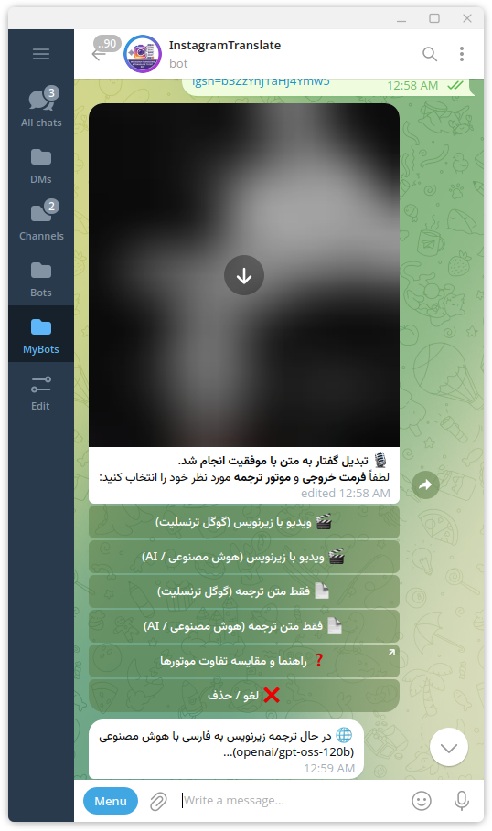
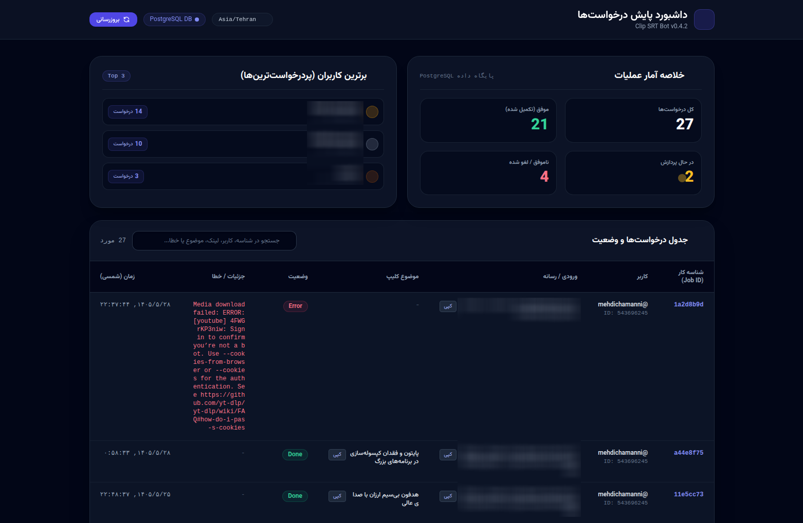

# Clip SRT Bot v2 🎬📝

[](https://opensource.org/licenses/MIT)
[](https://www.python.org/)
[](https://fastapi.tiangolo.com/)
[](https://www.docker.com/)
[](https://render.com/)
[](https://t.me/mehdichamanni)

[English](#english) | [فارسی](#فارسی)

---

<a name="english"></a>
## 🇬🇧 English Documentation

### 🌟 Overview & Key Features

**clip-srt-vps** is a lightweight, cloud-native Telegram bot and web service built with Python, FastAPI, and `python-telegram-bot`. It leverages state-of-the-art AI APIs (Groq Whisper, Google Gemini, OpenAI) and FFmpeg to extract audio, generate precise subtitle transcriptions, translate subtitles into fluent line-by-line Persian, and soft-embed subtitles into video clips on the fly.

- **Cloud-Native AI Workloads:** Uses Groq Whisper (`whisper-large-v3`) for lightning-fast speech-to-text with word-level timestamps.
- **Fluent Persian Translation:** Uses Groq AI (`openai/gpt-oss-120b`) for natural Persian translation with fallback to Google Gemini, while preserving exact `.srt` timing.
- **Line-by-Line Subtitles:** Produces alternating original language / Persian translation subtitles.
- **Fast Soft-Subtitle Embedding:** Soft-embeds subtitles into MKV containers via FFmpeg without full video re-encoding.
- **MP3 with Synced LRC Lyrics (Musicolet Standard):** Exports tagged MP3 audio with timestamped ID3 `USLT` synced lyrics and cover art directly playable in Musicolet and advanced Android music players.
- **Web Video Download Support:** Downloads videos directly from social media platforms using `yt-dlp`.
- **Telegram Bot Webhook Integration:** Powered by FastAPI with automatic webhook setup on startup.

### 📸 Screenshots & Preview

<p align="center">
  
  
</p>

---

### 📂 Supported Input Files & Link Formats

#### Supported Media Upload Formats
Direct media uploads to the bot (up to the Telegram 20 MB API limit):
- **Video Extensions:** `.mp4`, `.mkv`, `.mov`, `.avi`, `.webm`, `.flv`, `.m4v`
- **Audio & Voice Extensions:** `.mp3`, `.wav`, `.aac`, `.m4a`, `.flac`, `.ogg`, `.opus`, Telegram Voice messages (`.ogg`)

#### Supported Social Media & URL Links
Send video or audio URLs directly in chat for seamless processing without file size limits:
- **Instagram:** Reels, Posts, IGTV clips
- **YouTube:** YouTube Shorts, standard YouTube Videos
- **TikTok:** Public video clips
- **Twitter / X:** Video tweets
- **Direct Web Links:** Any publicly downloadable `.mp4`, `.mp3`, `.mkv` direct file URLs

---

### 🐳 Deployment Guide via Docker & Docker Compose

#### 1. Quick Start with Docker Compose (Recommended)

Make sure you have Docker and Docker Compose installed on your machine or VPS.

```bash
# 1. Clone the repository from GitHub
git clone https://github.com/mehdichamani/clip-srt-vps.git
cd clip-srt-vps

# 2. Prepare environment file
cp .env.example .env
# Edit .env file and fill in your TELEGRAM_BOT_TOKEN, GROQ_API_KEY, GEMINI_API_KEY, and RENDER_EXTERNAL_URL

# 3. Build and launch with Docker Compose
docker compose up -d --build
```

`docker-compose.yml` service definition:
```yaml
version: '3.8'

services:
  clip-srt-bot:
    build:
      context: .
      dockerfile: Dockerfile
    container_name: clip-srt-bot
    restart: always
    ports:
      - "8000:8000"
    env_file:
      - .env
    environment:
      - PORT=8000
```

#### 2. Manual Docker CLI Deployment

```bash
# Build Docker image
docker build -t clip-srt-vps .

# Run container with environment file
docker run -d \
  --name clip-srt-bot \
  --env-file .env \
  -p 8000:8000 \
  clip-srt-vps
```

---

### 🚀 Deploying to Render.com via Docker & GitHub

Render supports deploying this repository directly using **Docker** runtime built from your GitHub repository.

#### Step 1: Connect GitHub Repository to Render
1. Log in to [Render Dashboard](https://dashboard.render.com/).
2. Click **New +** -> **Web Service**.
3. Connect your GitHub repository `https://github.com/mehdichamani/clip-srt-vps`.
4. Select **Docker** as the Environment / Runtime (Render automatically detects `Dockerfile`).

#### Step 2: Configure YouTube & Instagram Cookies via Base64 Encoding
Platforms like YouTube and Instagram require cookie authentication for `yt-dlp` download requests. Because multiline `cookies.txt` files can be corrupted when pasted directly into cloud environment variables, **clip-srt-vps supports Base64-encoded cookie strings**.

1. Generate a single-line Base64 string from your local `cookies.txt` or `combined_cookies.txt`:
   ```bash
   # On Linux / VPS:
   base64 -w 0 cookies.txt

   # On macOS:
   base64 -i cookies.txt

   # On Windows (PowerShell):
   [Convert]::ToBase64String([IO.File]::ReadAllBytes("cookies.txt"))
   ```
2. Copy the resulting Base64 string.
3. In your Render Web Service dashboard, go to **Environment** -> **Add Environment Variable**.
4. Set Key: `YOUTUBE_COOKIES`, `INSTAGRAM_COOKIES`, or `COOKIES` and Value: `<your-base64-encoded-string>`.
5. When the application runs, it automatically decodes and merges the cookies into a valid temporary Netscape cookie file for `yt-dlp`.

#### Step 3: Add Required Environment Variables on Render
Add the following Environment Variables in your Render Web Service settings:

| Variable | Required | Description | Example |
| :--- | :---: | :--- | :--- |
| `TELEGRAM_BOT_TOKEN` | **Yes** | Telegram Bot token from [@BotFather](https://t.me/BotFather) | `123456789:ABCdef...` |
| `GROQ_API_KEY` | **Yes** | Groq API Key for Whisper STT & LLM Translation from [Groq Console](https://console.groq.com/) | `gsk_...` |
| `GEMINI_API_KEY` | Optional | Optional Google Gemini API key from [Google AI Studio](https://aistudio.google.com/) for fallback | `AIzaSy...` |
| `RENDER_EXTERNAL_URL` | **Yes** | Public Render service HTTPS URL (No trailing slash) | `https://clip-srt-vps.onrender.com` |
| `WEBHOOK_SECRET` | Optional | Secret token for secure webhook authorization | `random_secret_string` |
| `YOUTUBE_COOKIES` | Optional | Base64-encoded string of YouTube cookies for `yt-dlp` | `IyBOZXRzY2FwZSBDb29raWU...` |
| `INSTAGRAM_COOKIES` | Optional | Base64-encoded string of Instagram cookies for `yt-dlp` | `IyBOZXRzY2FwZSBDb29raWU...` |
| `COOKIES` | Optional | Base64-encoded string of combined Netscape cookies (`combined_cookies.txt`) | `IyBOZXRzY2FwZSBDb29raWU...` |
| `PORT` | Optional | Listening port (Render automatically sets `$PORT`) | `8000` |

---

### 👤 Developer & Repository Branding

- **Repository:** [mehdichamani/clip-srt-vps](https://github.com/mehdichamani/clip-srt-vps)
- **Developer:** **Mehdi Chamani** (مهدی چمنی)
- **Email:** `mahdi.chamani20@gmail.com`
- **Telegram:** [@mehdichamanni](https://t.me/mehdichamanni)

---

<a name="فارسی"></a>
## 🇮🇷 راهنمای فارسی (Persian Documentation)

### 🌟 معرفی پروژه و امکانات

**clip-srt-vps** یک ربات تلگرام و سرویس ابری سبک و هوشمند است که با زبان پایتون، فریم‌ورک FastAPI و کتابخانه `python-telegram-bot` توسعه یافته است. این ربات با بهره‌گیری از هوش مصنوعی Groq Whisper، Google Gemini و FFmpeg، صدا را استخراج کرده، زیرنویس دقیق را تولید می‌کند، آن را به فارسی روان ترجمه کرده و زیرنویس سافت‌ساب را روی ویدیو متصل می‌نماید.

- **تبدیل گفتار به متن هوشمند:** استفاده از Groq Whisper (`whisper-large-v3`) برای استخراج متن و زمان‌بندی دقیق زیرنویس.
- **ترجمه فارسی روان:** ترجمه خط به خط با مدل هوش مصنوعی (`openai/gpt-oss-120b`) و مترجم گوگل با حفظ کامل زمان‌بندی فایل `.srt`.
- **نمایش متناوب زیرنویس:** تولید زیرنویس دو زبانه (زبان اصلی / فارسی متناوب).
- **الصاق سریع زیرنویس سافت‌ساب:** الصاق زیرنویس روی ویدیو با کانتینر MKV بدون افت کیفیت و رندر مجدد.
- **خروجی صوت MP3 با لیریکس همگام زمانی (Musicolet LRC):** ساخت فایل صوتی MP3 با متادیتای استاندارد ID3 و تگ‌های `USLT` حاوی زمان‌بندی `[mm:ss.xx]` جهت پخش همگام و کارائوکه در اپلیکیشن موزیک‌پلیر Musicolet و سایر پلیرهای پیشرفته.
- **دانلود از شبکه‌های اجتماعی:** پشتیبانی از دریافت ویدیو از لینک‌های مختلف با `yt-dlp`.
- **معماری وب‌هوک:** پاسخ‌دهی سریع بر پایه FastAPI و ثبت خودکار Webhook.

---

### 📂 فرمت‌ها و لینک‌های پشتیبانی شده

#### فایل‌های قابل ارسال مستقیم
امکان ارسال مستقیم فایل به ربات (تا سقف محدودیت ۲۰ مگابایت تلگرام):
- **فرمت‌های ویدیو:** `.mp4`, `.mkv`, `.mov`, `.avi`, `.webm`, `.flv`, `.m4v`
- **فرمت‌های صوتی و ویس:** `.mp3`, `.wav`, `.aac`, `.m4a`, `.flac`, `.ogg`, `.opus`, ویس‌های تلگرام

#### لینک‌های پشتیبانی شده
ارسال لینک ویدیو یا صوت بدون محدودیت حجم فایل:
- **اینستاگرام:** ریلمز (Reels)، پست‌ها، و ویدیوهای IGTV
- **یوتیوب:** ویدیوهای اصلی و یوتیوب شورتس (Shorts)
- **تیک‌تاک:** کلیپ‌های ویدئویی تیک‌تاک
- **توییتر / ایکس:** ویدیوهای پست شده در Twitter/X
- **لینک‌های مستقیم:** تمامی لینک‌های مستقیم قابل دانلود با پسوند `.mp4` و `.mp3`

---

### 🐳 راهنمای استقرار با Docker و Docker Compose

#### ۱. راه‌اندازی سریع با Docker Compose (پیشنهادی)

اطمینان حاصل کنید که داکر و داکر کامپوز روی سرور یا سیستم شما نصب شده است.

```bash
# ۱. دریافت مخزن پروژه از گیت‌هاب
git clone https://github.com/mehdichamani/clip-srt-vps.git
cd clip-srt-vps

# ۲. ایجاد و تنظیم فایل متغیرهای محیطی
cp .env.example .env
# فایل .env را ویرایش کرده و توکن تلگرام و کلیدهای API را وارد کنید

# ۳. ساخت و اجرای کانتینر با داکر کامپوز
docker compose up -d --build
```

محتوای فایل `docker-compose.yml`:
```yaml
version: '3.8'

services:
  clip-srt-bot:
    build:
      context: .
      dockerfile: Dockerfile
    container_name: clip-srt-bot
    restart: always
    ports:
      - "8000:8000"
    env_file:
      - .env
    environment:
      - PORT=8000
```

---

### 🚀 استقرار روی Render.com با داکر (Docker Runtime)

سرویس **Render.com** به صورت مستقیم از **محیط اجرایی داکر (Docker)** و اتصال به مخزن گیت‌هاب پشتیبانی می‌کند.

#### گام اول: اتصال مخزن گیت‌هاب به Render
۱. وارد حساب کاربری خود در [Render.com](https://dashboard.render.com/) شوید.
۲. روی گزینه **New +** و سپس **Web Service** کلیک کنید.
۳. مخزن گیت‌هاب `https://github.com/mehdichamani/clip-srt-vps` را متصل کنید.
۴. نوع محیط اجرا (Runtime) را روی **Docker** قرار دهید (Render به صورت خودکار `Dockerfile` موجود در مخزن را شناسایی می‌کند).

#### گام دوم: تنظیم کوکی‌های یوتیوب و اینستاگرام با فرمت Base64
دانلود از یوتیوب یا اینستاگرام ممکن است نیازمند کوکی‌های معتبر جهت احراز هویت `yt-dlp` باشد. از آنجا که فرمت چندخطی فایل `cookies.txt` ممکن است در متغیرهای محیطی سرورهای ابری بهم بریزد، پروژه **clip-srt-vps** به طور کامل از فرمت **Base64** پشتیبانی می‌کند.

۱. تبدیل فایل `cookies.txt` یا `combined_cookies.txt` به یک رشته تک‌خطی Base64:
   ```bash
   # در لینوکس / VPS:
   base64 -w 0 cookies.txt

   # در مک (macOS):
   base64 -i cookies.txt

   # در ویندوز (PowerShell):
   [Convert]::ToBase64String([IO.File]::ReadAllBytes("cookies.txt"))
   ```
۲. رشته Base64 خروجی را کپی کنید.
۳. در داشبورد Render، به بخش **Environment** -> **Add Environment Variable** بروید.
۴. نام کلید را `YOUTUBE_COOKIES` یا `INSTAGRAM_COOKIES` یا `COOKIES` و مقدار آن را برابر با **رشته Base64 کپی‌شده** قرار دهید.
۵. ربات هنگام اجرا به طور خودکار این رشته‌ها را رمزگشایی کرده و فایل کوکی یکپارچه و معتبر ایجاد می‌کند.

#### گام سوم: تنظیم متغیرهای محیطی در Render

| متغیر | اجباری | توضیحات | نمونه |
| :--- | :---: | :--- | :--- |
| `TELEGRAM_BOT_TOKEN` | **بله** | توکن ربات دریافتی از [@BotFather](https://t.me/BotFather) | `123456789:ABCdef...` |
| `GROQ_API_KEY` | **بله** | کلید API سرور Groq برای تبدیل گفتار به متن و ترجمه هوشمند | `gsk_...` |
| `GEMINI_API_KEY` | اختیاری | کلید API جمینای از Google AI Studio برای جایگزین موقت (Fallback) | `AIzaSy...` |
| `RENDER_EXTERNAL_URL` | **بله** | آدرس عمومی HTTPS سرویس رندر برای ثبت وب‌هوک | `https://clip-srt-vps.onrender.com` |
| `WEBHOOK_SECRET` | اختیاری | توکن امنیتی وب‌هوک جهت تایید درگاه | `random_secret_string` |
| `YOUTUBE_COOKIES` | اختیاری | رشته Base64 شده فایل کوکی یوتیوب برای دانلود ویدیوها | `IyBOZXRzY2FwZSBDb29raWU...` |
| `INSTAGRAM_COOKIES` | اختیاری | رشته Base64 شده فایل `cookies.txt` برای دانلود از اینستاگرام | `IyBOZXRzY2FwZSBDb29raWU...` |
| `COOKIES` | اختیاری | رشته Base64 شده کوکی‌های ترکیبی Netscape برای تمام سرویس‌ها | `IyBOZXRzY2FwZSBDb29raWU...` |

---

### 👤 شناسنامه سازنده و مخزن

- **توسعه‌دهنده:** **مهدی چمنی**
- **ایمیل:** `mahdi.chamani20@gmail.com`
- **تلگرام:** [@mehdichamanni](https://t.me/mehdichamanni)
- **مخزن گیت‌هاب:** [https://github.com/mehdichamani/clip-srt-vps](https://github.com/mehdichamani/clip-srt-vps)
- **میزبانی شده در:** [Render.com](https://render.com) (توسط Docker Runtime)
